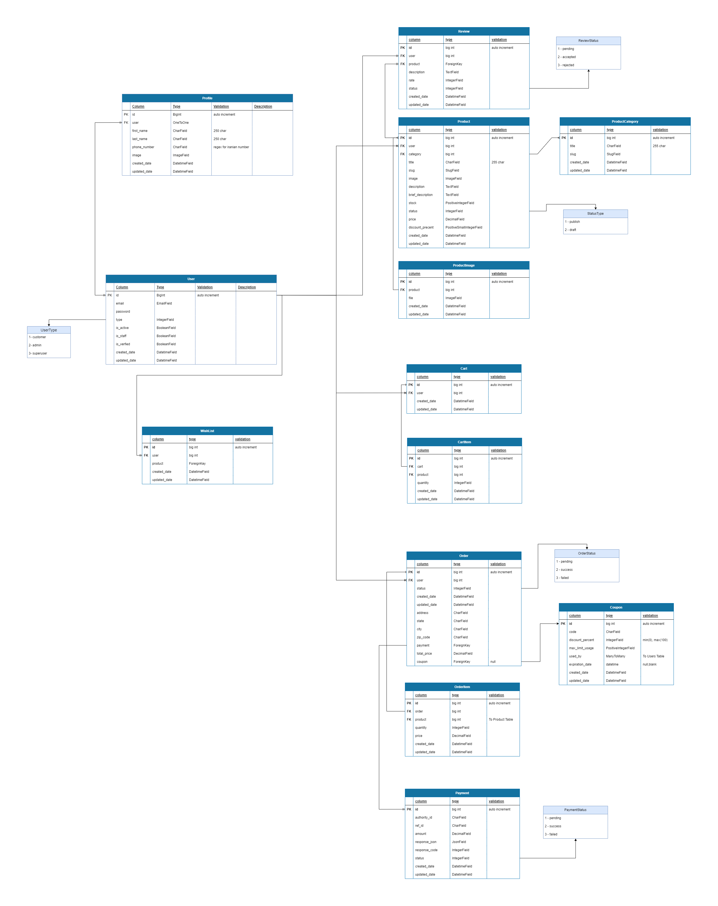

# CharkhoneApplication-Django

Charkhone Online Shop - A Django e-commerce project with Docker

## Table of Contents

- [About](#about)
- [Database Schema](#Database-Schema)
- [Services](#services)
- [Prerequisites](#prerequisites)
- [Installation](#installation)
- [Project Structure](#project-structure)
- [Environment Variables](#environment-variables)
- [Features](#features)
- [Useful Commands](#useful-commands)
- [Development](#development)
- [Troubleshooting](#troubleshooting)

---

## Database Schema



## About

CharkhoneApplication is an online shop built with Django. The project uses Docker Compose to manage services including PostgreSQL, Django, and smtp4dev for email testing.

---

## Services

| Service        | Version   | Ports                    | Description              |
| -------------- | --------- | ------------------------ | ------------------------ |
| **PostgreSQL** | 15-alpine | 5432                     | Primary database         |
| **Django**     | 5.2.16    | 8000                     | Web application          |
| **smtp4dev**   | v3        | 25 (SMTP), 5000 (Web UI) | Development email server |

---

## Prerequisites

- [Docker](https://docs.docker.com/get-docker/) (20.10+)
- [Docker Compose](https://docs.docker.com/compose/install/) (2.0+)

---

## Installation

### 1. Clone the repository

```bash
git clone <repository-url>
cd CharkhoneApplication-django
```

### 2. Create environment file

```bash
cp envs/dev/django/.env.sample envs/dev/django/.env
```

Edit `envs/dev/django/.env` with your settings:

```env
DJANGO_SECRET_KEY="your-secret-key"
DJANGO_DEBUG=True
DJANGO_ALLOWED_HOSTS=localhost,127.0.0.1,[::1]

POSTGRES_DB=postgres
POSTGRES_USER=postgres
POSTGRES_PASSWORD=postgres
POSTGRES_HOST=db
POSTGRES_PORT=5432

TIME_ZONE=UTC
```

> **Warning:** Change `DJANGO_SECRET_KEY` and database credentials for production.

### 3. Start the project

```bash
docker-compose up --build
```

### 4. Access the services

| Service      | URL                         |
| ------------ | --------------------------- |
| Django       | http://localhost:8000       |
| Django Admin | http://localhost:8000/admin |
| smtp4dev     | http://localhost:5000       |

### 5. Create admin user

```bash
docker exec -it charkhoneh-backend python manage.py createsuperuser
```

### 6. Run migrations

```bash
docker exec -it charkhoneh-backend python manage.py migrate
```

---

## Project Structure

```
CharkhoneApplication-django/
├── core/                          # Django project root
│   ├── core/                      # Project settings
│   │   ├── settings.py
│   │   ├── urls.py
│   │   └── wsgi.py
│   ├── accounts/                  # Authentication app
│   │   ├── models.py              # User, PasswordResetToken, Profile
│   │   ├── views.py               # LoginView, RequestPasswordReset, ResetPassword
│   │   ├── urls.py                # Account URL patterns
│   │   ├── forms.py               # Custom AuthenticationForm
│   │   ├── serializers.py         # DRF serializers
│   │   ├── utils.py               # JWT token utilities
│   │   ├── admin.py               # Custom admin configuration
│   │   ├── management/
│   │   │   └── commands/
│   │   │       └── cleanup_expired_tokens.py
│   │   └── tests/
│   │       └── test_model.py      # User and password reset tests
│   ├── website/                   # Main app
│   │   ├── views.py
│   │   ├── urls.py
│   │   ├── models.py
│   │   └── admin.py
│   ├── templates/                 # HTML templates
│   │   └── website/
│   │       ├── base.html
│   │       ├── index.html
│   │       ├── about.html
│   │       └── contact.html
│   ├── static/                    # Static files (CSS, JS, images, fonts)
│   ├── staticfiles/               # Collected static files
│   └── manage.py
├── dockerfiles/dev/django/        # Dockerfile
├── envs/dev/django/               # Environment variables
├── postgres/data/                 # Database files (gitignored)
├── docs/                          # Documentation
├── docker-compose.yml
├── requirements.txt
└── convert_static.py              # Static path converter utility
```

---

## Environment Variables

### Django

| Variable               | Default               | Description                     |
| ---------------------- | --------------------- | ------------------------------- |
| `DJANGO_SECRET_KEY`    | -                     | Required. Django secret key     |
| `DJANGO_DEBUG`         | `False`               | Enable debug mode               |
| `DJANGO_ALLOWED_HOSTS` | `localhost,127.0.0.1` | Allowed hosts (comma-separated) |

### PostgreSQL

| Variable            | Default    | Description                         |
| ------------------- | ---------- | ----------------------------------- |
| `POSTGRES_DB`       | `postgres` | Database name                       |
| `POSTGRES_USER`     | `postgres` | Database user                       |
| `POSTGRES_PASSWORD` | `postgres` | Database password                   |
| `POSTGRES_HOST`     | `db`       | Database host (Docker service name) |
| `POSTGRES_PORT`     | `5432`     | Database port                       |

### Other

| Variable    | Default | Description |
| ----------- | ------- | ----------- |
| `TIME_ZONE` | `UTC`   | Timezone    |

---

## Features

### Password Reset (JWT-based)

A complete password reset flow using JWT tokens with 48-hour expiry.

#### How it works

1. **Request reset** - User sends their email to `/accounts/request-reset/`
2. **Email sent** - A JWT token is generated and sent via email (viewable in smtp4dev at http://localhost:5000)
3. **Reset password** - User clicks the link and submits a new password with the token to `/accounts/reset-password/`

#### API Endpoints

| Endpoint                  | Method | Description                        |
| ------------------------- | ------ | ---------------------------------- |
| `/accounts/request-reset/` | POST   | Send reset email                   |
| `/accounts/reset-password/`| POST   | Reset password with token          |

#### Request Reset

```bash
curl -X POST http://localhost:8000/accounts/request-reset/ \
  -H "Content-Type: application/json" \
  -d '{"email": "user@example.com"}'
```

Response:
```json
{"message": "در صورت وجود ایمیل، لینک بازیابی ارسال شد."}
```

#### Reset Password

```bash
curl -X POST http://localhost:8000/accounts/reset-password/ \
  -H "Content-Type: application/json" \
  -d '{"token": "<jwt-token>", "new_password": "NewP@ssw0rd123"}'
```

Response:
```json
{"message": "رمز عبور با موفقیت تغییر یافت."}
```

#### Security Features

- **JWT Token** - Tokens are signed with Django's `SECRET_KEY` using HS256 algorithm
- **48-hour expiry** - Tokens expire after 48 hours
- **One-time use** - Tokens are marked as used after successful password reset
- **Rate limiting** - 3 requests per hour via `ScopedRateThrottle`
- **Password validation** - Uses Django's built-in password validators
- **No email enumeration** - Same response regardless of whether the email exists
- **Token cleanup** - Expired tokens are cleaned up on user login

#### Token Cleanup

```bash
# Manual cleanup of expired tokens
docker exec -it charkhoneh-backend python manage.py cleanup_expired_tokens
```

#### Testing

```bash
# Run all tests including password reset tests
docker exec -it charkhoneh-backend python manage.py test accounts
```

---

### Django Debug Toolbar

Debug toolbar is integrated for development debugging and performance analysis.

#### Access

When `DJANGO_DEBUG=True`, the debug toolbar appears on the right side of every page at http://localhost:8000.

#### Features

- **SQL Panel** - View all database queries with timing
- **Request/Response** - Inspect headers, cookies, session data
- **Templates** - View template rendering times
- **Static Files** - Check static file serving
- **Cache** - Monitor cache usage
- **Settings** - View all Django settings
- **Logging** - View log messages

#### Configuration

Debug toolbar is configured in `settings.py`:

```python
# Only active when DEBUG=True
INSTALLED_APPS = [
    ...
    'debug_toolbar',
]

MIDDLEWARE = [
    ...
    "debug_toolbar.middleware.DebugToolbarMiddleware",
]

# Auto-detects IP for Docker environments
INTERNAL_IPS = [ip, '127.0.0.1', '10.0.2.2']
```

> **Note:** Debug toolbar is only visible when `DJANGO_DEBUG=True`. Never enable debug mode in production.

---

## Useful Commands

### Docker

```bash
docker-compose up                    # Start services
docker-compose up -d                 # Start in background
docker-compose down                  # Stop services
docker-compose up --build            # Rebuild and start
docker-compose logs -f               # View logs
docker-compose logs -f backend       # View specific service logs
```

### Django Management

```bash
# Run manage.py commands
docker exec -it charkhoneh-backend python manage.py <command>

# Create superuser
docker exec -it charkhoneh-backend python manage.py createsuperuser

# Run migrations
docker exec -it charkhoneh-backend python manage.py migrate

# Collect static files
docker exec -it charkhoneh-backend python manage.py collectstatic

# Cleanup expired password reset tokens
docker exec -it charkhoneh-backend python manage.py cleanup_expired_tokens

# Run tests
docker exec -it charkhoneh-backend python manage.py test accounts

# Django shell
docker exec -it charkhoneh-backend python manage.py shell
```

### Database

```bash
# Access PostgreSQL shell
docker exec -it charkhoneh-db psql -U postgres
```

---

## Development

### Static Path Converter

The `convert_static.py` script converts hardcoded static paths in HTML files to Django `` tags:

```bash
# Convert all templates
python convert_static.py --dir core/templates

# Dry run (preview changes without modifying)
python convert_static.py --dir core/templates --dry-run

# Create backups before modifying
python convert_static.py --dir core/templates --backup
```

### smtp4dev (Email Testing)

smtp4dev captures all outgoing emails during development:

- **Web UI:** http://localhost:5000
- **SMTP Server:** localhost:25

Configure Django to use smtp4dev:

```python
# settings.py
EMAIL_BACKEND = 'django.core.mail.backends.smtp.EmailBackend'
EMAIL_HOST = 'smtp4dev'
EMAIL_PORT = 25
EMAIL_USE_TLS = False
```

### Persian Fonts

The project includes two Persian fonts:
- **Vazir** - Primary font
- **IRANSans** - Alternative font

---

## Dependencies

| Package                         | Version | Purpose                    |
| ------------------------------- | ------- | -------------------------- |
| django                          | 5.2.16  | Web framework              |
| psycopg[binary]                 | 3.1.12  | PostgreSQL adapter         |
| python-decouple                 | 3.8     | Environment variables      |
| pillow                          | 10.2.0  | Image processing           |
| django-debug-toolbar            | 4.2.0   | Debug toolbar              |
| django-rest-framework           | -       | REST API framework         |
| djangorestframework-simplejwt   | -       | JWT authentication         |
| requests                        | 2.31.0  | HTTP client                |
| sqlparse                        | 0.4.4   | SQL parser                 |

---

## Available Routes

| Path                         | Method | Name             | Description                    |
| ---------------------------- | ------ | ---------------- | ------------------------------ |
| `/`                          | GET    | `home_page`      | Home page                      |
| `/about/`                    | GET    | `about_page`     | About page                     |
| `/contact/`                  | GET    | `contact_page`   | Contact page                   |
| `/admin/`                    | GET    | -                | Django admin panel             |
| `/accounts/login/`           | GET    | `login`          | Login page                     |
| `/accounts/logout/`          | GET    | `logout`         | Logout                         |
| `/accounts/request-reset/`   | POST   | `request-reset`  | Request password reset email   |
| `/accounts/reset-password/`  | POST   | `reset-password` | Reset password with token      |

---

## Troubleshooting

### Database Connection Error

Ensure the `db` service is running:

```bash
docker-compose ps
docker-compose logs db
```

### Port Already in Use

Change the port mapping in `docker-compose.yml`:

```yaml
ports:
  - '8001:8000'  # Use port 8001 instead
```

### Reset Database

```bash
docker-compose down -v
rm -rf postgres/data/*
docker-compose up --build
```

---

## License

Private project.
