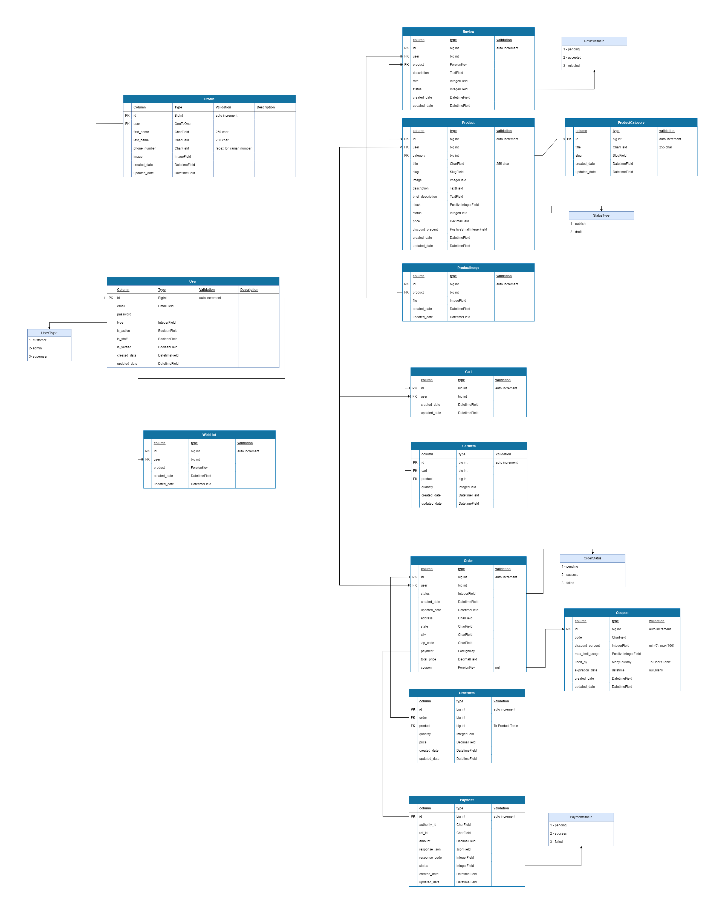
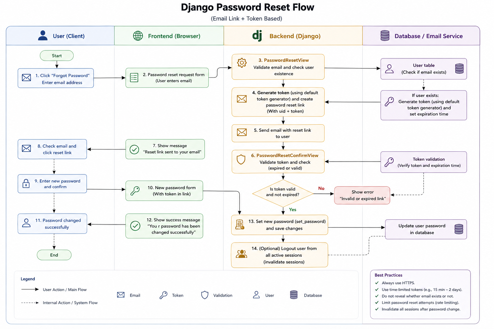
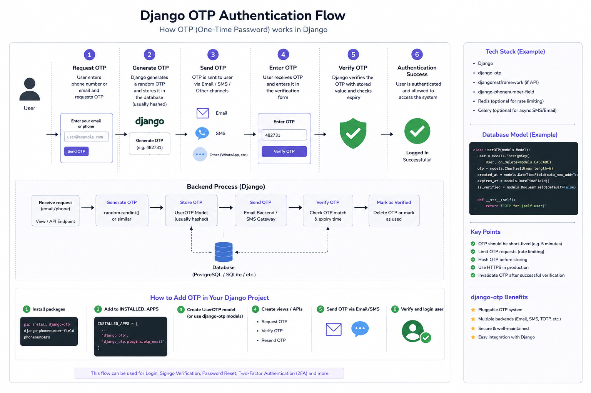

# CharkhoneApplication-Django

A modular Django e-commerce platform built with Django 5.2, Django REST Framework, and Docker. It provides a Persian RTL online shop with product catalog, user authentication, password reset via JWT-like tokens, and a complete admin interface.

## Table of Contents

- [Overview](#overview)
- [Features](#features)
- [Demo](#demo)
  - [Video Example](#video-example)
  - [Image Example](#image-example)
- [Requirements](#requirements)
- [Configuration](#configuration)
- [Installation](#installation)
- [Usage](#usage)
  - [Lint and Reformat + Pre-commit (Optional)](#lint-and-reformat--pre-commit-optional)
  - [Documentation](#documentation)
  - [Testing (Optional)](#testing-optional)
- [Project Structure](#project-structure)
- [Architecture](#architecture)
- [Deployment](#deployment)
- [Known Issues](#known-issues)
- [References and Definitions (Optional)](#references-and-definitions-optional)
- [License](#license)
- [Support / Contact](#support--contact)

---

## Overview

### What is the project?

CharkhoneApplication is a foundational e-commerce platform (MVP) built with Django 5.2 and a modular app architecture. It is containerized with Docker Compose and targets the Persian (Farsi) market with full RTL support, Persian fonts (Vazir), and localized date/number formatting.

### What problem does it solve?

It provides a production-ready starting point for online stores with:
- Secure user authentication and password reset flows
- Product catalog with categories, filtering, search, and pagination
- Admin panel for managing products, categories, and users
- Development tooling for email testing and debugging

### Who is it for?

- Persian-speaking developers looking for a Django e-commerce boilerplate
- Teams needing a modular, service-oriented Django codebase
- Projects requiring Docker-based development environments with PostgreSQL

---

## Features

- **Custom User Authentication** — Email-based login with `AbstractBaseUser`, user types (customer, admin, superuser), and profile management
- **Password Reset via JWT-like Tokens** — 48-hour expiry, one-time use, rate limiting, account locking after failed attempts, and no email enumeration
- **Product Catalog** — Slug-based product routing, categories, stock tracking, discount percentages, and final price calculation
- **Product Filtering & Search** — Search by title, filter by price range and category, sort by price/date, with pagination
- **Django Admin Integration** — Custom admin configurations for User, Profile, PasswordResetToken, ProductCategory, and ProductModel
- **Django Debug Toolbar** — SQL queries, request/response inspection, template timing, and settings viewer (development only)
- **Email Testing with smtp4dev** — Captures all outgoing emails locally at http://localhost:5000
- **Celery + Redis** — Configured for asynchronous task processing (e.g., email sending)
- **Django OTP** — TOTP and static token plugins installed for future two-factor authentication
- **Persian Localization** — RTL layout, Vazir font, `intcomma` for Persian number formatting
- **Load Testing with Locust** — Preconfigured Locust master/worker setup
- **Test Data Generation** — Faker-based management commands for creating test categories and products in English or Persian
- **Static Path Converter** — Utility script to convert hardcoded static paths to Django `` tags

---

## Demo

### Video Example

[](https://www.youtube.com/watch?v=VIDEO_ID)

### Image Example







---

## Requirements

### Prerequisites

- [Docker](https://docs.docker.com/get-docker/) (20.10+)
- [Docker Compose](https://docs.docker.com/compose/install/) (2.0+)

### Supported Versions

- Python 3.11 (via `python:3.11-slim-bookworm` Docker image)
- PostgreSQL 15-alpine
- Django 5.2.16

### Dependencies

| Package                 | Version | Purpose                   |
| ----------------------- | ------- | ------------------------- |
| `django`                | 5.2.16  | Web framework             |
| `djangorestframework`   | 3.17.1  | REST API framework        |
| `psycopg[binary]`       | 3.1.12  | PostgreSQL adapter        |
| `python-decouple`       | 3.8     | Environment variables     |
| `pillow`                | 10.2.0  | Image processing          |
| `django-debug-toolbar`  | 4.2.0   | Debug toolbar             |
| `celery`                | 5.4.0   | Async task queue          |
| `django-celery-results` | 2.5.1   | Celery result backend     |
| `django-otp`            | 1.7.0   | OTP/TOTP support          |
| `pytest`                | 9.1.1   | Test runner               |
| `pytest-django`         | 4.14.0  | Django pytest integration |
| `Faker`                 | 40.36.0 | Test data generation      |
| `requests`              | 2.31.0  | HTTP client               |
| `sqlparse`              | 0.4.4   | SQL parser                |

See `requirements.txt` and `core/requirements.txt` for the full pinned dependency list.

---

## Configuration

### Environment Variables

The project uses `python-decouple` to load environment variables from `envs/dev/django/.env`. The sample file (`envs/dev/django/.env.sample`) is empty by default; create your `.env` with the following variables:

#### Django

| Variable               | Default               | Description                     |
| ---------------------- | --------------------- | ------------------------------- |
| `DJANGO_SECRET_KEY`    | *(required)*          | Django secret key               |
| `DJANGO_DEBUG`         | `True`                | Enable debug mode               |
| `DJANGO_ALLOWED_HOSTS` | `localhost,127.0.0.1` | Allowed hosts (comma-separated) |
| `TIME_ZONE`            | `UTC`                 | Timezone                        |

#### PostgreSQL

| Variable            | Default    | Description                         |
| ------------------- | ---------- | ----------------------------------- |
| `POSTGRES_DB`       | `postgres` | Database name                       |
| `POSTGRES_USER`     | `postgres` | Database user                       |
| `POSTGRES_PASSWORD` | `postgres` | Database password                   |
| `POSTGRES_HOST`     | `db`       | Database host (Docker service name) |
| `POSTGRES_PORT`     | `5432`     | Database port                       |

#### Email (smtp4dev)

| Variable        | Default    | Description |
| --------------- | ---------- | ----------- |
| `EMAIL_HOST`    | `smtp4dev` | SMTP host   |
| `EMAIL_PORT`    | `25`       | SMTP port   |
| `EMAIL_USE_TLS` | `False`    | Enable TLS  |

#### Celery

| Variable                | Default                    | Description      |
| ----------------------- | -------------------------- | ---------------- |
| `CELERY_BROKER_URL`     | `redis://localhost:6379/0` | Redis broker URL |
| `CELERY_RESULT_BACKEND` | `django-db`                | Result backend   |

> **Warning:** Never commit `.env` to version control. Change `DJANGO_SECRET_KEY` and database credentials for production.

### Configuration Files

- `docker-compose.yml` — Service definitions for db, backend, locust_master, locust_worker, and smtp4dev
- `core/core/settings.py` — Django settings, middleware, installed apps, REST framework config
- `core/core/.flake8` — Flake8 linting configuration (max line length 120)
- `core/pytest.ini` — pytest configuration for Django test discovery

### Optional Settings

- `DJANGO_DEBUG=True` enables Django Debug Toolbar
- `CELERY_BROKER_URL` can be pointed to a production Redis instance
- `EMAIL_USE_TLS=True` for production SMTP servers

---

## Installation

### 1. Clone the repository

```bash
git clone <repository-url>
cd CharkhoneApplication-django
```

### 2. Create environment file

```bash
cp envs/dev/django/.env.sample envs/dev/django/.env
```

Edit `envs/dev/django/.env` with your settings (see [Configuration](#configuration) for all variables).

### 3. Start the project

```bash
docker-compose up --build
```

### 4. Access the services

| Service      | URL                         |
| ------------ | --------------------------- |
| Django       | http://localhost:8000       |
| Django Admin | http://localhost:8000/admin |
| smtp4dev     | http://localhost:5000       |
| Locust       | http://localhost:8089       |

### 5. Create admin user

```bash
docker exec -it charkhoneh-backend python manage.py createsuperuser
```

### 6. Run migrations

```bash
docker exec -it charkhoneh-backend python manage.py migrate
```

### 7. (Optional) Seed test data

```bash
# Create test categories
docker exec -it charkhoneh-backend python manage.py create_test_categories

# Create test products with images
docker exec -it charkhoneh-backend python manage.py create_test_products
```

---

## Usage

### Starting the project

```bash
docker-compose up --build
```

### Stopping the project

```bash
docker-compose down
```

To also remove volumes (database data):

```bash
docker-compose down -v
```

### Running external commands

```bash
# Django management commands
docker exec -it charkhoneh-backend python manage.py <command>

# PostgreSQL shell
docker exec -it charkhoneh-db psql -U postgres

# View logs
docker-compose logs -f
docker-compose logs -f backend
```

### Basic usage

- Browse the shop at http://localhost:8000
- Log in at http://localhost:8000/accounts/login/
- Access the admin panel at http://localhost:8000/admin
- Test password reset flow via the API at `/accounts/request-reset/` and `/accounts/reset-password/`
- View captured emails at http://localhost:5000

### Common workflows

- **Add a product:** Use Django admin or create via API (extend `shop/api/v1/` if needed)
- **Manage users:** Django admin or custom admin panel
- **Debug SQL queries:** Enable `DJANGO_DEBUG=True` and use Django Debug Toolbar
- **Monitor async tasks:** Configure Celery with a production Redis broker

---

### Lint and Reformat + Pre-commit (Optional)

The project includes a `.flake8` configuration at `core/core/.flake8` for code linting.

```bash
# Run flake8 (requires local Python environment, not inside Docker)
flake8 core/
```

**Pre-commit hooks** are not currently configured. If you want to add them, create `.pre-commit-config.yaml` and install hooks with `pre-commit install`.

### Documentation

- **API Reference:** See `core/accounts/api/v1/urls.py` for DRF endpoints
- **CLI Reference:** Django management commands in `core/accounts/management/commands/` and `core/shop/management/commands/`
- **Additional Guides:**
  - Password reset flow documented in the [Features](#features) section
  - smtp4dev email testing guide in [Configuration](#configuration)

### Testing (Optional)

The project uses **pytest** with `pytest-django`.

```bash
# Run all tests
docker exec -it charkhoneh-backend python manage.py test

# Run specific app tests
docker exec -it charkhoneh-backend python manage.py test accounts
docker exec -it charkhoneh-backend python manage.py test shop

# Run with pytest (if installed locally)
pytest core/
```

**Test files:**
- `core/accounts/tests/test_model.py` — User manager tests
- `core/accounts/tests/test_password_reset.py` — Password reset API tests
- `core/shop/tests/test_products.py` — Product tests (placeholder)

**Test requirements:** `pytest`, `pytest-django`, `Faker` (listed in `core/requirements.txt`)

---

## Project Structure

```
CharkhoneApplication-django/
├── core/                              # Django project root (mounted to /usr/src/app in Docker)
│   ├── core/                          # Project settings package
│   │   ├── __init__.py
│   │   ├── .flake8                    # Flake8 configuration
│   │   ├── asgi.py                    # ASGI config
│   │   ├── celery.py                  # Celery app configuration
│   │   ├── settings.py                # Django settings
│   │   ├── urls.py                    # Root URL configuration
│   │   └── wsgi.py                    # WSGI config
│   ├── accounts/                      # Authentication & user management app
│   │   ├── __init__.py
│   │   ├── admin.py                   # Custom admin configuration
│   │   ├── apps.py
│   │   ├── forms.py                   # Custom AuthenticationForm
│   │   ├── models.py                  # User, Profile, PasswordResetToken
│   │   ├── throttles.py               # Rate limiting classes
│   │   ├── tasks.py                   # Celery async tasks
│   │   ├── urls.py                    # Account URL patterns
│   │   ├── views/                     # Views package
│   │   │   ├── __init__.py
│   │   │   ├── account_views.py       # LoginView
│   │   │   └── password_views.py      # Password reset views
│   │   ├── api/v1/                    # DRF API endpoints
│   │   │   ├── __init__.py
│   │   │   ├── serializers.py
│   │   │   ├── urls.py
│   │   │   └── views.py
│   │   ├── services/                  # Business logic layer
│   │   │   ├── __init__.py
│   │   │   ├── email.py
│   │   │   ├── password_reset.py
│   │   │   └── tokens.py
│   │   ├── management/commands/       # Custom management commands
│   │   │   ├── __init__.py
│   │   │   └── cleanup_tokens.py
│   │   ├── migrations/                # Database migrations
│   │   └── tests/                     # Test suite
│   │       ├── __init__.py
│   │       ├── test_model.py
│   │       └── test_password_reset.py
│   ├── shop/                          # E-commerce product catalog app
│   │   ├── __init__.py
│   │   ├── admin.py
│   │   ├── apps.py
│   │   ├── filters.py                 # Search, price, category filters
│   │   ├── managers.py                # ProductQuerySet with .published()
│   │   ├── models.py                  # ProductCategory, ProductModel, ProductImageModel
│   │   ├── services.py                # Price calculation utilities
│   │   ├── urls.py
│   │   ├── views.py                   # ProductListView, ProductDetailView
│   │   ├── management/commands/       # Data seeding commands
│   │   │   ├── __init__.py
│   │   │   ├── check_database.py
│   │   │   ├── create_test_categories.py
│   │   │   └── create_test_products.py
│   │   ├── migrations/                # Database migrations
│   │   └── tests/                     # Test suite
│   │       ├── __init__.py
│   │       └── test_products.py
│   ├── website/                       # Main website/pages app
│   │   ├── __init__.py
│   │   ├── admin.py
│   │   ├── apps.py
│   │   ├── models.py
│   │   ├── urls.py
│   │   ├── views.py                   # Index, About, Contact views
│   │   └── tests/
│   │       └── __init__.py
│   ├── templates/                     # HTML templates
│   │   ├── messages.html
│   │   ├── accounts/                  # Auth templates
│   │   │   ├── login.html
│   │   │   ├── passwod_reset.html
│   │   │   ├── password_reset_complete.html
│   │   │   ├── password_reset_confirm.html
│   │   │   ├── password_reset_done.html
│   │   │   ├── password_reset_email.html
│   │   │   └── reset_password_confirm.html
│   │   ├── shop/
│   │   │   ├── product-details.html
│   │   │   └── product-grid.html
│   │   └── website/
│   │       ├── about.html
│   │       ├── base.html
│   │       ├── contact.html
│   │       └── index.html
│   ├── static/                        # Source static files
│   │   ├── css/
│   │   ├── fonts/vazir/               # Persian fonts
│   │   ├── img/                       # Product images (various sizes)
│   │   ├── js/
│   │   └── svg/                       # Logos, brands, illustrations
│   ├── staticfiles/                   # Collected static files (gitignored)
│   ├── media/                         # User-uploaded media (gitignored)
│   │   └── product/
│   │       ├── images/
│   │       └── extra-img/
│   ├── locust/                        # Load testing
│   │   └── locustfile.py
│   ├── manage.py
│   ├── pytest.ini
│   ├── requirements.txt
│   └── convert_static.py              # Static path converter utility
├── dockerfiles/dev/django/
│   └── Dockerfile                     # Python 3.11-slim-bookworm base
├── envs/dev/django/
│   ├── .env                           # Active environment file (gitignored)
│   └── .env.sample                    # Empty sample
├── postgres/
│   └── data/                          # PostgreSQL volume (gitignored)
├── docs/                              # Documentation assets
│   ├── .gitkeep
│   ├── db-diagram.drawio
│   ├── db-diagram.png
│   ├── Django-otp.png
│   └── Reset_Password_Flow.png
├── docker-compose.yml
├── requirements.txt
├── convert_static.py
├── .gitignore
└── README.md
```

---

## Architecture

### High-level design

The project follows a **modular Django app architecture** with clear separation of concerns:

- **Core project** (`core/core/`) — Settings, URL routing, WSGI/ASGI configuration
- **Apps** — `accounts`, `shop`, `website` are independent Django apps with their own models, views, URLs, and tests
- **Service layer** — Business logic is extracted into `services/` modules within apps (e.g., `accounts/services/`)
- **API layer** — DRF endpoints are organized under `api/v1/` for versioning
- **Containerization** — Docker Compose orchestrates PostgreSQL, Django, Celery broker (Redis), smtp4dev, and Locust

### Components

| Component      | Location                   | Responsibility                         |
| -------------- | -------------------------- | -------------------------------------- |
| **Website**    | `core/website/`            | Static pages (home, about, contact)    |
| **Accounts**   | `core/accounts/`           | Auth, password reset, user management  |
| **Shop**       | `core/shop/`               | Product catalog, categories, filtering |
| **Core**       | `core/core/`               | Settings, middleware, URL config       |
| **PostgreSQL** | Docker service `db`        | Primary database                       |
| **smtp4dev**   | Docker service `smtp4dev`  | Development email server               |
| **Locust**     | Docker services `locust_*` | Load testing                           |

### Data flow

1. **Request** → Django URL router (`core/urls.py`) → App-level URL (`accounts/urls.py`, `shop/urls.py`, `website/urls.py`)
2. **View** → Template rendering (server-side) or DRF serializer (API)
3. **Business logic** → Service layer (`services/`) if applicable
4. **Database** → Django ORM → PostgreSQL
5. **Async tasks** → Celery broker (Redis) → Worker execution

### Design patterns applied

- **SRP (Single Responsibility Principle)** — Services separated from views
- **OCP (Open/Closed Principle)** — Strategy-based filters in shop (`filters.py`)
- **DIP (Dependency Inversion Principle)** — Email source abstracted in accounts services

---

## Deployment

### Production setup

The current configuration is optimized for local development with Docker. For production:

1. **Environment variables** — Set `DJANGO_DEBUG=False`, strong `DJANGO_SECRET_KEY`, production database credentials, and a real SMTP server
2. **Static files** — Run `python manage.py collectstatic` and serve via Nginx or a CDN
3. **Database** — Use a managed PostgreSQL service or persistent volume backups
4. **Celery** — Deploy Redis and Celery workers as separate services
5. **Gunicorn/Uvicorn** — Replace `runserver` with a production ASGI/WSGI server

### Deployment instructions

```bash
# Build production image
docker build -t charkhone-backend ./dockerfiles/dev/django

# Run with production environment
docker run -p 8000:8000 \
  -e DJANGO_SECRET_KEY=prod-secret \
  -e DJANGO_DEBUG=False \
  -e POSTGRES_HOST=your-db-host \
  charkhone-backend
```

### CI/CD

No CI/CD pipeline is currently configured. Future additions could include:
- GitHub Actions / GitLab CI for automated testing
- Docker image building and pushing to a registry
- Automated migrations on deployment

---

## Known Issues

### Limitations

- **No payment gateway integration** — The project is an MVP without checkout or payment processing
- **No inventory management** beyond basic `stock` field on `ProductModel`
- **Django OTP installed but unused** — TOTP/static token plugins are in `INSTALLED_APPS` but not wired into views
- **Celery broker not containerized** — Redis is expected at `localhost:6379` but is not defined in `docker-compose.yml`
- **No CI/CD** — Manual testing and deployment only
- **`.env.sample` is empty** — Does not document required environment variables
- **Persian-only frontend** — No i18n/l10n framework for multi-language support

### Current problems

- Typo in template filename: `passwod_reset.html` (missing `r`)
- `django-rest-framework` version shows `0.1.0` in `requirements.txt` (likely a packaging metadata issue; DRF itself is versioned separately)
- No production ASGI/WSGI server configured
- Locust master host points to `http://backend:8089` but Django runs on port 8000

---

## References and Definitions (Optional)

- **Django** — A high-level Python web framework that encourages rapid development and clean, pragmatic design
- **Docker Compose** — A tool for defining and running multi-container Docker applications
- **DRF (Django REST Framework)** — A powerful toolkit for building Web APIs in Django
- **JWT (JSON Web Token)** — A compact, URL-safe means of representing claims to be transferred between two parties
- **Celery** — A distributed task queue for Python
- **OTP (One-Time Password)** — A password that is valid for only one login session or transaction
- **RTL (Right-to-Left)** — A writing system where text starts from the right side of the page
- **MVP (Minimum Viable Product)** — A version of a product with just enough features to be usable by early customers
- **SRP / OCP / DIP** — SOLID design principles applied in the codebase

---

## MIT License


Copyright (c) 2026 Amin Attaei

Permission is hereby granted, free of charge, to any person obtaining a copy
of this software and associated documentation files (the "Software"), to deal
in the Software without restriction, including without limitation the rights
to use, copy, modify, merge, publish, distribute, sublicense, and/or sell
copies of the Software, and to permit persons to whom the Software is
furnished to do so, subject to the following conditions:

The above copyright notice and this permission notice shall be included in all
copies or substantial portions of the Software.

THE SOFTWARE IS PROVIDED "AS IS", WITHOUT WARRANTY OF ANY KIND, EXPRESS OR
IMPLIED, INCLUDING BUT NOT LIMITED TO THE WARRANTIES OF MERCHANTABILITY,
FITNESS FOR A PARTICULAR PURPOSE AND NONINFRINGEMENT. IN NO EVENT SHALL THE
AUTHORS OR COPYRIGHT HOLDERS BE LIABLE FOR ANY CLAIM, DAMAGES OR OTHER

Private project.

---

## Support / Contact

For questions or support regarding this project, please contact the project maintainer.

